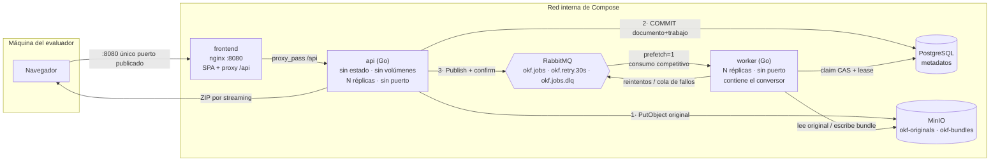
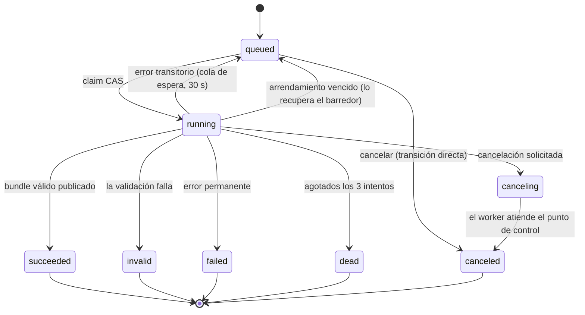

# Arquitectura

Documento de apoyo para el segmento de arquitectura de la sustentación.

## Diagrama de servicios



## El orden de las tres escrituras de la carga

No es arbitrario y es lo primero que conviene explicar:

```
1. PutObject del original      Si algo falla después, sobra un objeto; nunca falta.
2. COMMIT (documento + trabajo) El COMMIT precede SIEMPRE al publish.
3. Publish + publisher confirm  Y sólo entonces se marca el encolado confirmado.
4. Responder 202 con el job_id
```

Publicar antes del commit abre una carrera real: con el worker ocioso el consumo
ocurre en milisegundos, el worker recibiría un `job_id` que aún no existe en la
base de datos y el trabajo se perdería de forma **intermitente**, que es el peor
modo de fallo posible para una demostración en directo.

## Ciclo de vida del trabajo



Todos los estados terminales excepto `succeeded` admiten reintento, que crea un
trabajo **hijo** enlazado al anterior: así la evidencia del intento fallido queda
inmutable.

## Por qué la conversión no puede ocurrir en la petición HTTP

Es una garantía **estructural**, no una promesa:

```bash
go list -deps ./cmd/api | grep internal/okf     # sin resultados
```

El binario de la API no contiene el paquete del conversor. Para que eso sea
cierto, `internal/app` está partido en dos paquetes (`apiapp` y `convert`),
porque Go resuelve dependencias por paquete y no por fichero. La detección de
formato, que la API sí necesita en la carga, vive en `internal/domain`.

El empaquetador ZIP vive en `internal/bundlezip` y **no** bajo `internal/okf`,
precisamente para que esta comprobación no dé un falso positivo: la API necesita
empaquetar, pero empaquetar no es convertir.

El test `internal/arch_test.go` lo verifica en cada ejecución de la batería.

## Las tres barreras de la ausencia de duplicados

```
1. Transición CAS al reclamar     UPDATE ... WHERE status='queued'
                                     OR (status='running' AND lease vencido)
2. Reclamo del bundle ANTES de     INSERT INTO bundles ... ON CONFLICT (job_id)
   copiar al prefijo servible        DO NOTHING RETURNING id
3. Índices únicos parciales        bundles(job_id)
                                   jobs(document_id) WHERE estado activo
                                   jobs(parent_job_id) WHERE parent NOT NULL
```

La barrera 2 es la que suele faltar. Con sólo el índice único, un segundo intento
no puede crear la segunda **fila**, pero sí sobrescribe los **objetos** del
prefijo publicado mientras el usuario los está descargando. Reclamar antes de
promover convierte la publicación en un único escritor por construcción.

## Guion de la sustentación (20 min)

| # | Segmento | Min | Qué se ve en pantalla | Criterio |
|---|---|---|---|---|
| 1 | Presentación | 1 | Integrantes, declaración del uso de IA, índice con marcas de tiempo | Encuadre |
| 2 | Arquitectura | 3 | Este diagrama · `docker inspect okfp-api-1 --format '{{json .Mounts}}'` → `[]` · justificación de cola, base de datos y almacenamiento | 20 % + 10 % |
| 3 | Despliegue | 1,5 | `docker compose down -v` · `docker volume ls` en cámara · `docker compose up --build` desde cero | 20 % |
| 4 | Flujo completo | 4 | Frontend: registro, C2 (leer en voz alta «una unidad, sin advertencias»), C3 (clic en los enlaces del índice), descarga del ZIP, HTML con badge ámbar | 15 % + 10 % + 15 % |
| 5 | Asincronía | 2 | `curl.exe -w "%{time_total}"` sobre 12 MiB · cerrar el cliente · `docker compose stop api` y el trabajo continúa · `--scale worker=4` | 10 % |
| 6 | Aislamiento | 1,5 | Beto abre el bundle de Ana → **404 idéntico** al de un UUID inventado · `WHERE owner_id` en pantalla | 10 % |
| 7 | Bundle y validación | 2,5 | `index.md`, `log.md`, conceptos · C4 (`select count(*) from bundles` → 0, prefijo ausente en MinIO) · **C6** (reinyectar x3 → 1 bundle) | 10 % + 15 % |
| 8 | Código Go | 3 | Endpoint que encola y retorna · publish con confirm · claim CAS · tabla de decisión de duplicados · `go test -run TestProcessJob` en verde | 20 % |
| 9 | Cierre | 1,5 | Limitaciones conocidas, trabajo futuro, reflexión sobre el uso de IA | Encuadre |

### Cobertura de las condiciones verificables

| Condición | Segmento | Evidencia concreta |
|---|---|---|
| C1 Asincronía | 5 (y 4 de apoyo) | 202 en milisegundos sobre 12 MiB · cliente cerrado · API detenida y el trabajo prosigue |
| C2 Documento breve | 4 | `{index.md, log.md, documento.md}` · veredicto válido · **cero advertencias** en `log.md` |
| C3 Documento estructurado | 4 | Un concepto por unidad · los enlaces del índice navegan en orden |
| C4 Bundle incompleto | 7 | `invalid` sin fila en `bundles` · sin botón de descarga · prefijo ausente en MinIO |
| C5 Aislamiento | 6 | 404 indistinguible del de un identificador inexistente · 401 sin token |
| C6 Sin duplicados | 7 (test en 8) | Reinyección x3 → un solo bundle · traza con las entregas descartadas |

### Comandos preparados

Todos los comandos del guion están en `README.md` §5 y automatizados en
`scripts/verify-conditions.ps1`, de modo que en el vídeo se pueden copiar y pegar
sin errores de tecleo.

### Antes de grabar

- `docker compose down -v` y `docker volume ls` **en cámara**: el entorno debe
  verse limpio.
- Generar el documento grande: `go run ./cmd/tools gen-large --sections 400`.
- Arrancar con `DEV_TOOLS=true` para poder demostrar la reinyección.
- Comprobar que `DEMO_SLOW_MODE_MS` es `0` y mostrarlo: la lentitud de la
  demostración de asincronía debe ser trabajo real.
- Ensayar con cronómetro y grabar por segmentos; tener una toma de respaldo de
  los segmentos 5 y 7, que dependen de tiempos reales.
